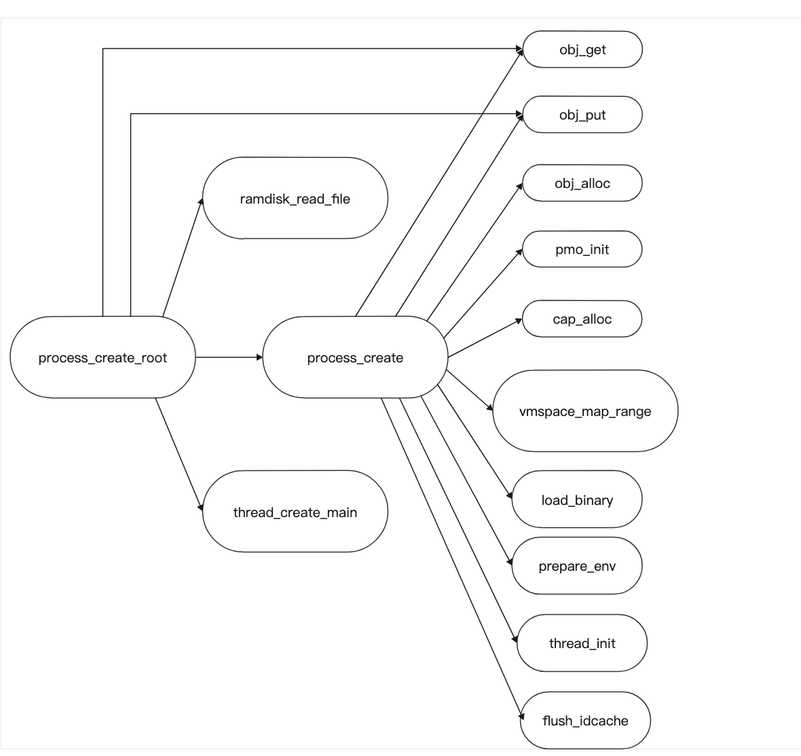

# Lab3

## 518021910515 许嘉琦

## 练习2

`process_create_root`先读bin文件，之后创建一个新的进程，之后调用`thread_creat_main`创建线程；`thread_creat_main`创建一个进程中的第一个线程，先初始化栈之后加载elf文件内容，准备环境之后调用`thread_init`初始化线程，flush`idcache`之后返回；之后把当前线程变为`root_thread`

## 练习4

系统调用使用`SVC`指令触发同步异常，跳转到`syscall_table` 中的对应条目；对应的处理代码为`sync_el0_64`所指的代码段，在其中检查如果满足系统调用的条件就调用`el0_syscall` ; `el0_syscall`则会按照`syscall_table`跳转到对应处理函数上

## 练习7

`kernel`由`eret` 指令完成了从内核模式到用户模式的切换，开始执行`START`,并没有设置`LR`，所以返回地址是0 

