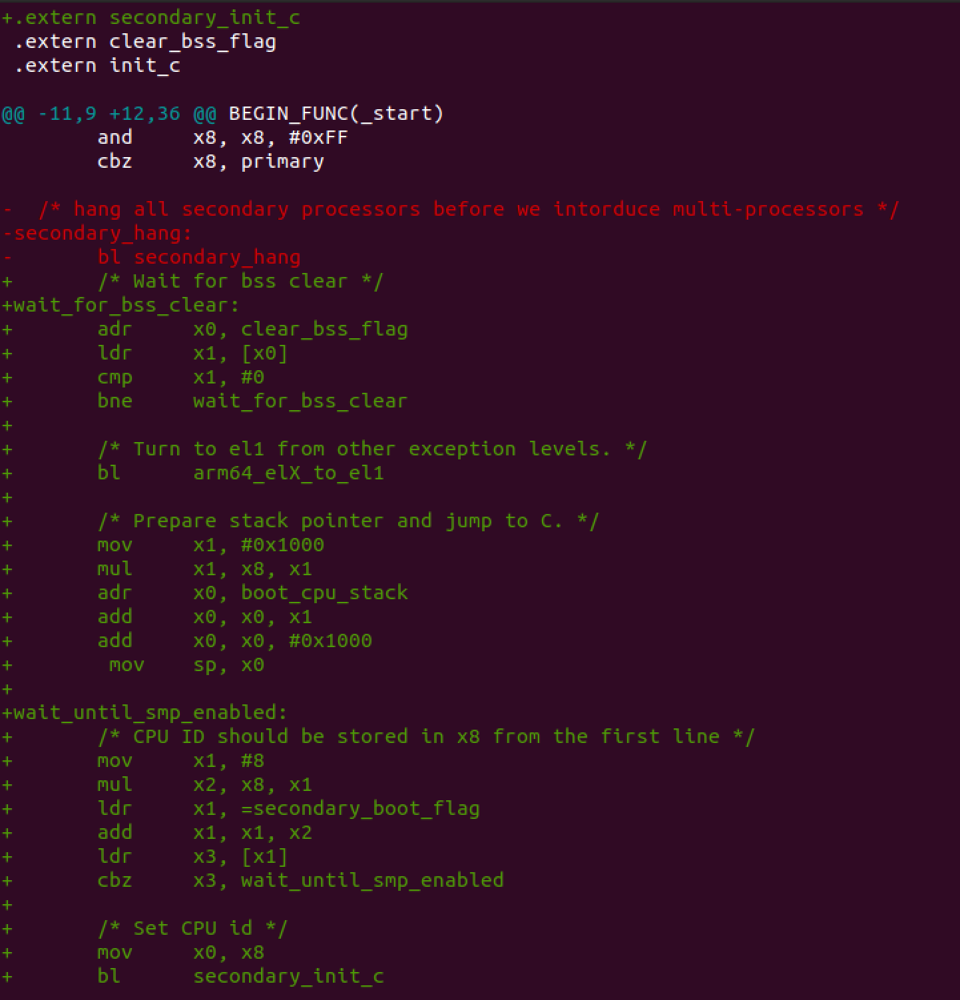
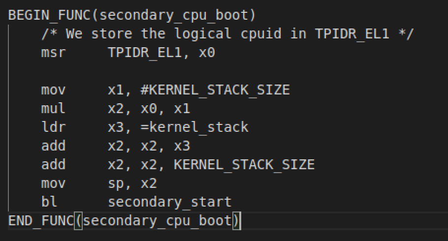

# lab4

## 518021910515 许嘉琦

---

#### 练习1

选定主CPU：取`0`为`primary CPU`

阻塞副CPU执行：通过设置`secondary_boot_flag`

#### 练习3

由图所示，各CPU使用的内核栈不重叠，并且由于只会修改对应号的状态，所以不会导致数据竞争，可以并发激活

#### 练习6

`lock_kernel`中使用了`x0,x1,x2`等寄存器，可能改变其中的值，所以需要放在栈上保护

#### 练习8

`idle`线程在内核态运行正常状态下不应该拿大内核锁，否则内核会被永远阻塞；所以在捕获错误的时候需要获取大内核锁
